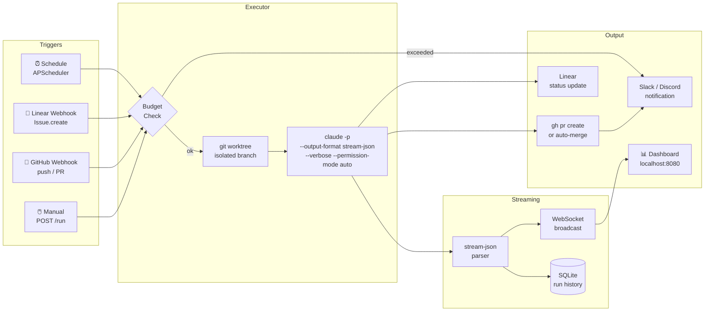
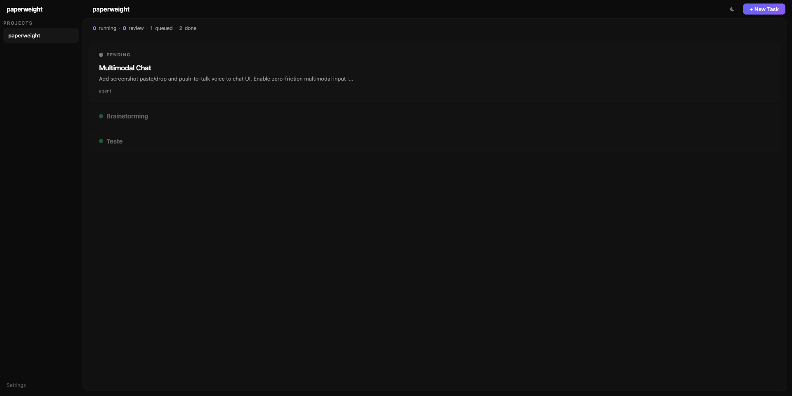
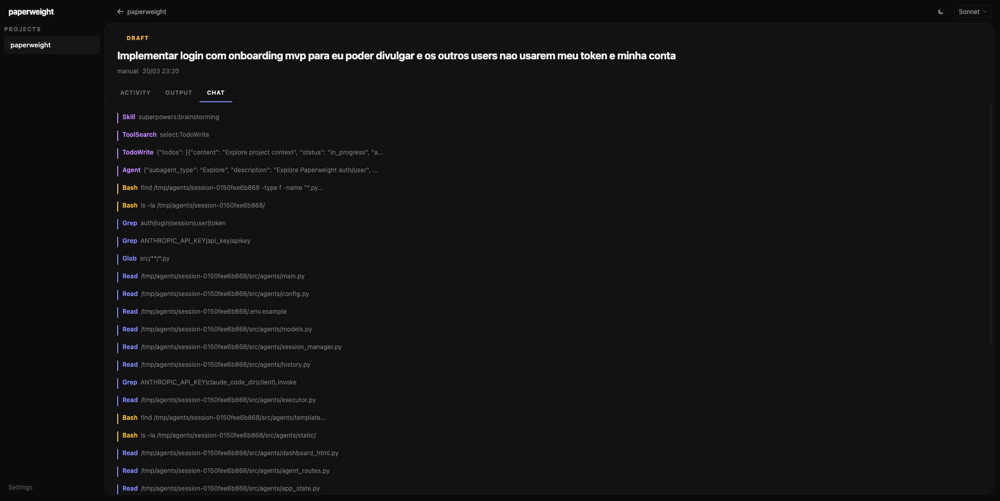
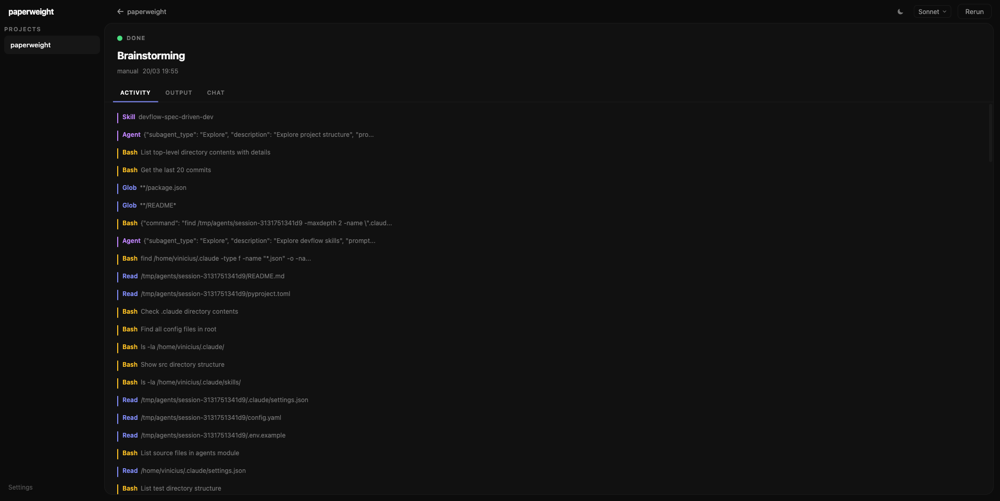
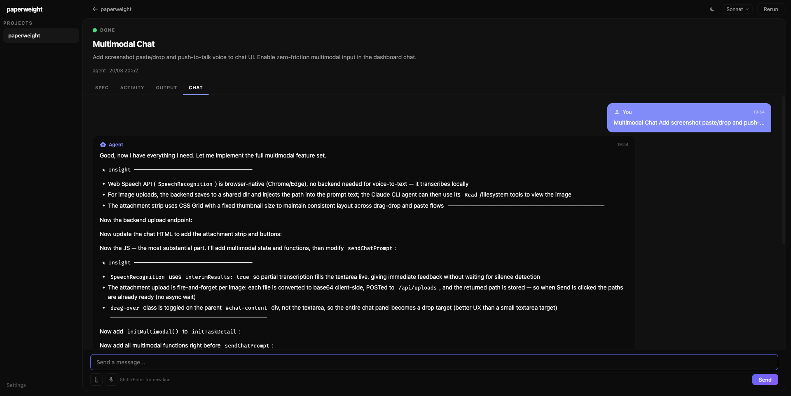
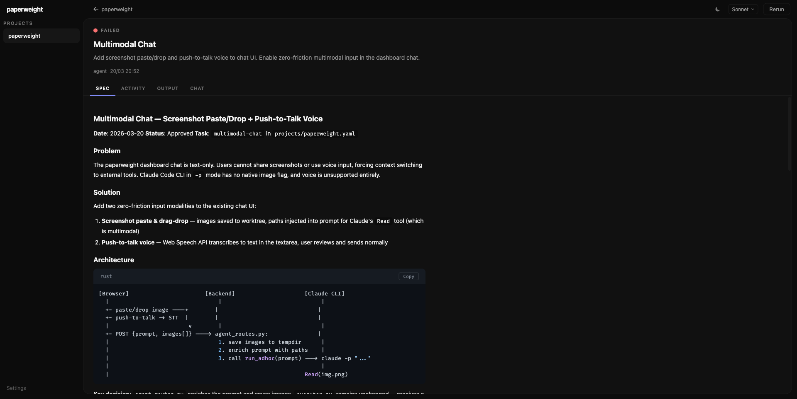

<div align="center">

# 📎 paperweight

**Your codebase works while you sleep.**

*A lean background agent runner for Claude Code — like [Paperclip](https://github.com/paperclipai/paperclip), but without the org charts.*

[](https://python.org)
[](#running-tests)
[](LICENSE)
[](https://claude.ai/code)

</div>

---

## The problem nobody talks about

You've seen it. You open Claude Code, give it a task, and it's *brilliant*. It reads files, writes tests, opens PRs. You feel like you hired a senior engineer.

Then you close the laptop.

And nothing happens. Because Claude Code needs someone at the keyboard.

**Your backlog doesn't care that it's 2am. Your Linear board isn't going to resolve itself. And the scheduled maintenance that "someone should automate" has been on the roadmap for six months.**

Claude Code is powerful. But it's a tool, not a worker. You're still the one triggering it.

---

## What if it just ran?

paperweight runs Claude Code in the background, headless, on schedules and event triggers — without you.

It wakes up when a Linear issue is labeled `agent`. It runs the daily dependency audit at 6am. It resolves the GitHub issue that came in at midnight. It creates the PR, updates the ticket, sends you a Slack message, and goes back to sleep.

You show up in the morning to a list of PRs waiting for your review.

```
[09:00] myapp/issue-resolver triggered by linear:Issue.create (ENG-142)
[09:00] ↳ worktree /tmp/agents/myapp-issue-resolver-20260316-090012-a3f1b2
[09:00] ↳ claude -p "Implement ENG-142 — Add pagination to /api/users" --model claude-sonnet-4-6
[09:01] ↳ tool: Read(src/api/users.py)
[09:01] ↳ tool: Read(tests/test_users.py)
[09:02] ↳ tool: Edit(src/api/users.py) — added cursor-based pagination
[09:03] ↳ tool: Bash(pytest tests/test_users.py -v) — 12 passed
[09:04] ↳ tool: Bash(gh pr create ...) — https://github.com/org/myapp/pull/88
[09:04] ↳ PR created: $0.84 — 23 turns — 4m 12s
[09:04] ↳ Linear: ENG-142 → In Review
```

---

## Why not just use Paperclip?

[Paperclip](https://github.com/paperclipai/paperclip) is impressive — 27k stars, org charts, multi-company support. It's building the Kubernetes of AI agents.

paperweight is what you need before you need Kubernetes.

| | paperweight | Paperclip |
|---|---|---|
| Setup | `uv run agents` | Node.js + PostgreSQL + pnpm |
| Config | One YAML file | Org charts + approval gates |
| Focus | Claude Code (native) | Multi-agent (OpenClaw, CC, Codex, Cursor) |
| Governance | Paired with [devflow](https://github.com/viniciuscffreitas/devflow) | Built-in hierarchy |
| Scale | Your repos | Enterprise multi-company |
| Streams | Real-time `stream-json` parsing | Dashboard |

We built paperweight without knowing Paperclip existed. Different angle, same problem. The name is intentional.

---

## How it works



### The stream-json loop

Every line Claude Code writes to stdout is a JSON event. paperweight parses them in real time:

```python
# tool call happening right now
{"type": "assistant", "message": {"content": [{"type": "tool_use", "name": "Edit", "input": {"file_path": "..."}}]}}

# result with actual cost from the CLI itself
{"type": "result", "total_cost_usd": 0.84, "num_turns": 23, "is_error": false}
```

No polling. No waiting. You see every tool call as it happens, in the dashboard and over WebSocket.

### Git worktrees for true isolation

Every run gets its own worktree — a separate working directory pointing to a new branch, sharing the same `.git` history:

```
/tmp/agents/
  myapp-issue-resolver-20260316-090012-a3f1b2/  ← run A (branch: agents/issue-resolver-20260316-090012)
  myapp-daily-audit-20260316-060000-ff9c4d/      ← run B (branch: agents/daily-audit-20260316-060000)
```

Two agents working on the same repo simultaneously. No conflicts. Worktrees are removed after the run.

---

## Quickstart

```bash
git clone https://github.com/viniciuscffreitas/paperweight
cd paperweight
cp .env.example .env
```

Edit `.env`:
```bash
CLAUDE_CODE_OAUTH_TOKEN=your-token   # or ANTHROPIC_API_KEY
SECRET_KEY=any-random-string         # enables auth (optional)
SLACK_WEBHOOK_URL=https://...        # enables notifications (optional)
```

```bash
uv run agents
```

Open **`http://localhost:8080`**. Create a project YAML in `projects/`, label a Linear issue with `agent`, and watch it resolve itself.

> **Prerequisites:** `claude` CLI and `gh` CLI must be installed and authenticated. See [Requirements](#requirements).

---

## Authentication

paperweight is a multi-user server with invite-code gating.

```
/login      → username + password
/register   → invite code required (admin creates codes)
```

**How it works:**
- Passwords hashed with `pbkdf2_hmac` (SHA-256, built-in, no extra deps)
- Each user brings their own Anthropic API key — entered at registration, stored encrypted with [Fernet](https://cryptography.io/en/latest/fernet/) symmetric encryption keyed from `SECRET_KEY`
- Sessions: random 32-byte hex token in SQLite (no JWT)
- Admin users can generate invite codes with optional expiry dates from the `/admin/invites` page

```bash
# Set a strong SECRET_KEY — without it, API keys won't survive restart
SECRET_KEY=your-random-secret-here uv run agents
```

No user data is sent anywhere. The API key lives encrypted in your SQLite database and is decrypted only in-process when running an agent.

---

## The dashboard



The UI is **bold-minimal**: dark chrome sidebar on the left, bright content panel on the right — an L-chrome layout. No decorative elements. Every pixel earns its place.

Built with **HTMX + Jinja2** on the server side and plain JS on the client. No framework, no build step, no node_modules.

### Layout

```
┌──────────┬──────────────────────────────────────┐
│ sidebar  │  topbar (breadcrumb + actions)        │
│          ├──────────────────────────────────────┤
│ projects │                                       │
│  ▸ myapp │   content panel                       │
│  ▸ infra │   (task list, task detail, etc.)      │
│          │                                       │
│ Settings │                                       │
└──────────┴──────────────────────────────────────┘
```

### Task list

Each project has a task list showing all work items in priority order. Active tasks float to the top. Done tasks show as compact rows at the bottom.

At a glance: status dot (running pulses), title, source badge, cost, and a direct link to the PR if one was created.

Stats bar at the top shows running / review / queued counts and today's budget spend.

### Task detail: four tabs

Click any task to open the detail view. Every task has four tabs:

| Tab | What you see |
|---|---|
| **Spec** | The spec document auto-discovered from `docs/` — shown if a `.md` file matches the task title or description. Read-only preview with syntax highlighting. |
| **Activity** | Live feed of every tool call the agent made: `Edit(src/api/users.py)`, `Bash(pytest ...)`, `Grep(...)`. Color-coded by tool type. |
| **Output** | The agent's final text response, rendered as Markdown with syntax-highlighted code blocks. |
| **Chat** | Conversational interface to the running agent (see below). |

The topbar shows a **model selector** (Sonnet / Haiku / Opus) and a context-aware action button: **Start** (pending/ready), **Cancel** (running), **Rerun** (done/failed), or **View PR** (if a PR was created).

---

## Brainstorming-first workflow

paperweight has a first-class brainstorming mode. Tasks start as `draft` — the agent *thinks before it codes*.

### The lifecycle

```
draft → ready → running → done
```

| Status | What's happening |
|---|---|
| `draft` | Agent is brainstorming: exploring the codebase, asking questions, writing a spec |
| `ready` | Spec is written and approved. Waiting for "Start" |
| `running` | Agent is implementing: TDD, tests, lint, PR |
| `done` | PR created or task completed |

### How it works

When you create a task with title "Add OAuth login", paperweight immediately:

1. Opens a Claude session in **brainstorming mode** — explicitly forbidden from writing code
2. The agent reads `CLAUDE.md`, explores the repo, and asks you clarifying questions via chat
3. Proposes 2-3 approaches with trade-offs
4. When you approve, writes a spec to `docs/superpowers/specs/`
5. PATCHes the task status to `ready` via the internal API
6. Stops. The chat shows the full conversation.

You review the spec in the **Spec tab**, then click **Start** to begin implementation.

**Why this matters:** The agent never touches source code until the design is locked. No wasted implementation work. No "oops I built the wrong thing."





---

## Chat

Every task has a live chat panel. It looks and behaves like a messaging app, but the other side is Claude Code running inside your repo.



### Features

- **WhatsApp-style layout**: your messages on the right (blue), agent on the left (dark), with timestamps and avatars
- **Markdown rendering**: agent responses render fully — headers, bold, lists, inline code
- **Syntax-highlighted code blocks**: language label + one-click copy button on every code block
- **Streaming with typewriter effect**: responses appear character by character, then re-render as Markdown when complete
- **Tool call groups**: agent tool calls appear as a collapsible "N tools used" card, keeping the conversation clean
- **Message actions** (hover to reveal): copy, edit (put text back in input), retry (re-send last message)
- **Thinking indicator**: three animated dots while the agent is processing

### Multimodal

paperweight supports images in chat — no extra setup.

**Screenshot paste:** press Cmd+V with a screenshot in clipboard. The image attaches to your next message.

**Drag-and-drop:** drop any image file onto the chat panel.

**Push-to-talk voice:** hold the microphone button and speak. Uses the browser's native `SpeechRecognition` API — no server-side transcription, no API cost.



---

## Configure a project

Drop a YAML file in `projects/`:

```yaml
# projects/myapp.yaml
name: myapp
repo: /path/to/your/repo
base_branch: main
branch_prefix: agents/
notify: slack

tasks:
  # Resolves Linear issues automatically when labeled "agent"
  issue-resolver:
    description: "Resolve a Linear issue end-to-end"
    intent: "Implement the given Linear issue following CLAUDE.md: TDD, lint, tests, PR"
    trigger:
      type: linear
      events: [Issue.create, Issue.update]
      filter:
        label: agent
    model: claude-sonnet-4-6
    max_cost_usd: 2.00
    autonomy: pr-only

  # Runs every morning at 6am
  daily-audit:
    description: "Audit dependencies and open issues for known CVEs"
    intent: "Check for outdated packages and security advisories. Create a PR with fixes."
    schedule: "0 6 * * *"
    model: claude-haiku-4-5-20251001
    max_cost_usd: 0.50
    autonomy: pr-only

  # Runs every Sunday at 2am
  weekly-cleanup:
    description: "Clean up dead code, unused imports, and TODO comments with issues"
    intent: "Identify and remove dead code. File issues for TODOs without tickets."
    schedule: "0 2 * * 0"
    model: claude-sonnet-4-6
    max_cost_usd: 1.00
    autonomy: auto-merge
```

---

## Global config

```yaml
# config.yaml
budget:
  daily_limit_usd: 10.00        # hard stop across all projects
  warning_threshold_usd: 7.00   # Slack alert before hitting the limit
  pause_on_limit: true

execution:
  default_model: sonnet
  default_autonomy: pr-only     # never merges without your review
  max_concurrent: 3             # runs in parallel
  timeout_minutes: 15
  dry_run: false                # set true to preview without executing

notifications:
  slack_webhook_url: ${SLACK_WEBHOOK_URL}

integrations:
  linear_api_key: ${LINEAR_API_KEY}
  discord_bot_token: ${DISCORD_BOT_TOKEN}
  github_token: ${GITHUB_TOKEN}
  slack_bot_token: ${SLACK_BOT_TOKEN}
```

All secrets from environment variables. Nothing hardcoded.

---

## Autonomy modes

paperweight never does more than you told it to.

| Mode | What happens |
|---|---|
| `pr-only` | Agent creates branch + PR. You review and merge. |
| `auto-merge` | Agent merges after PR passes CI. |
| `notify` | Dry run — reports what it *would* do. Nothing touched. |

Default is `pr-only`. You're always in control of what lands on `main`.

---

## Requirements

| Dependency | Why | Required? |
|---|---|---|
| [Python 3.13+](https://python.org) | Runtime | Yes |
| [uv](https://github.com/astral-sh/uv) | Package manager | Yes |
| [Claude Code](https://docs.anthropic.com/en/docs/claude-code) | The `claude` CLI must be installed and authenticated | Yes |
| [GitHub CLI](https://cli.github.com/) (`gh`) | Used to create PRs after each run | Yes, for `pr-only` / `auto-merge` |
| [git](https://git-scm.com/) 2.5+ | Worktree support for run isolation | Yes |
| Public URL or [ngrok](https://ngrok.com/) | Webhooks need to reach your server | Only for Linear/GitHub triggers |

> **Note:** `claude` and `gh` must be in your `$PATH` and authenticated before starting paperweight. The executor calls them directly as subprocesses.

---

## Pairing with devflow

paperweight handles the background. [devflow](https://github.com/viniciuscffreitas/devflow) handles the foreground.

```
Interactive session (you + Claude Code)
  └── devflow: TDD enforcement, spec-driven dev, parallel agents, context window monitor

Background session (no one watching)
  └── paperweight: scheduled runs, webhook triggers, budget control, real-time streaming
```

devflow is the guardrails. paperweight is the engine. Together they form a complete autonomous coding stack.

Install devflow:

```bash
git clone https://github.com/viniciuscffreitas/devflow ~/.claude/devflow
bash ~/.claude/devflow/install.sh
```

---

## API

```bash
# Core
POST /tasks/{project}/{task}/run    # Trigger a task
POST /runs/{run_id}/cancel          # Cancel a running task
GET  /status                        # Budget + runs + projects
GET  /health                        # Deep check (db, disk, scheduler)
GET  /api/metrics                   # 7-day trends (cost, success rate, duration)

# WebSocket
WS   /ws/runs/{run_id}             # Stream events for a run
WS   /ws/runs                      # Stream all events

# Work items
GET  /api/work-items?project={id}
POST /api/work-items
PATCH /api/work-items/{id}

# Agent chat
POST /api/projects/{project_id}/agent
POST /api/sessions/{session_id}/message

# Webhooks
POST /webhooks/linear              # Linear issue events
POST /webhooks/github              # GitHub push/PR/issue events
```

---

## Webhooks

Webhooks require your server to be reachable from the internet. For local development, use a tunnel:

```bash
# ngrok (free tier works)
ngrok http 8080
# → https://abc123.ngrok.io  ← use this as your webhook URL
```

### Linear

1. In Linear Settings → API → Webhooks → create webhook pointing to `https://your-host/webhooks/linear`
2. Select events: `Issue` (create, update)
3. Label issues with `agent` to trigger runs
4. paperweight auto-deduplicates: same issue won't trigger twice within 120s

### GitHub

1. In repo Settings → Webhooks → add `https://your-host/webhooks/github`
2. Select: `push`, `pull_request`, `issues`
3. Set secret in `.env` as `GITHUB_WEBHOOK_SECRET`
4. Label issues with `agent` to trigger runs (same as Linear)

### No webhooks? No problem

Scheduled tasks (`schedule: "0 6 * * *"`) and manual triggers (`POST /tasks/{project}/{task}/run`) work without any external connectivity. Webhooks are optional.

---

## Running tests

```bash
uv run pytest tests/ -q
# 789 tests, ~13s
```

---

## Stack

- **[FastAPI](https://fastapi.tiangolo.com/)** — HTTP server, webhook handlers, REST API
- **[Jinja2](https://jinja.palletsprojects.com/)** — server-rendered HTML templates
- **[HTMX](https://htmx.org/)** — partial page updates without writing JavaScript
- **[APScheduler](https://apscheduler.readthedocs.io/)** — cron scheduling
- **[SQLAlchemy](https://www.sqlalchemy.org/) + SQLite** — run history and task store (zero ops)
- **[cryptography](https://cryptography.io/)** — Fernet encryption for API keys at rest
- **[marked.js](https://marked.js.org/)** — Markdown rendering in chat and output tabs
- **[highlight.js](https://highlightjs.org/)** — syntax highlighting for code blocks
- **[Claude Code CLI](https://claude.ai/code)** — `claude -p --output-format stream-json --verbose`

---

## Where paperweight sits: the 5 levels of AI agent autonomy

Borrowed from the [SAE self-driving framework](https://arxiv.org/abs/2506.12469) adapted for AI agents:

| Level | Role | Description | Example |
|-------|------|-------------|---------|
| L1 | Operator | You type every command | Regular Claude Code |
| L2 | Collaborator | You and the agent share control | Claude Code + devflow |
| L3 | Consultant | Agent leads, asks you when stuck | Brainstorming mode |
| **L4** | **Approver** | **Agent works alone, you review PRs** | **paperweight today** |
| L5 | Observer | Fully autonomous, you just monitor | Coming soon |

paperweight is at **L4**. The agent resolves issues, writes tests, and opens PRs — you review and merge. Working toward L5 for low-risk tasks (dependency updates, lint fixes) while keeping L4 for business logic.

---

## Roadmap

- [ ] GitHub OAuth — login, repo discovery, automatic webhook setup
- [ ] Repo health scanner — daily Claude session that finds problems and creates tasks
- [ ] PCP mediator — resolve merge conflicts between concurrent agents
- [ ] Docker image + one-click deploy
- [ ] Admin dashboard: invite management, user list, global budget view
- [x] Retry with exponential backoff (3x, transient failures)
- [x] Deep health check (`/health` — db, disk, scheduler, returns 503 if degraded)
- [x] Metrics API + dashboard widget (7d trends: cost, success rate, duration)
- [x] Rate limiting (120 req/min per IP)
- [x] Automated cleanup (run artifacts, orphan worktrees, old events)
- [x] Overnight digest (Slack summary of runs/PRs/failures)
- [x] GitHub Issues trigger (label `agent` → work item)
- [x] Structured JSON logging (`LOG_FORMAT=json`)
- [x] DB schema version tracking
- [x] CI pipeline (lint + test + type check)
- [x] Authentication — login, register, invite codes, encrypted API keys
- [x] Brainstorming lifecycle — draft → ready → running → done
- [x] Chat — WhatsApp layout, streaming, markdown, code blocks, multimodal
- [x] Task-centric UI — Spec / Activity / Output / Chat tabs
- [x] Bold-minimal UI — L-chrome layout, HTMX + Jinja2, dark/light themes

---

## Contributing

paperweight is early. Issues, PRs, and ideas welcome.

If you're building something in the same space — background agents, Claude Code orchestration, autonomous coding pipelines — [open a discussion](https://github.com/viniciuscffreitas/paperweight/discussions). We're figuring this out together.

---

## License

MIT — use it, fork it, build on it.

---

<div align="center">

*Built without knowing [Paperclip](https://github.com/paperclipai/paperclip) existed.*
*Turns out we were solving the same problem from a different angle.*

**[⭐ Star if you're building with autonomous agents](https://github.com/viniciuscffreitas/paperweight)**

</div>
