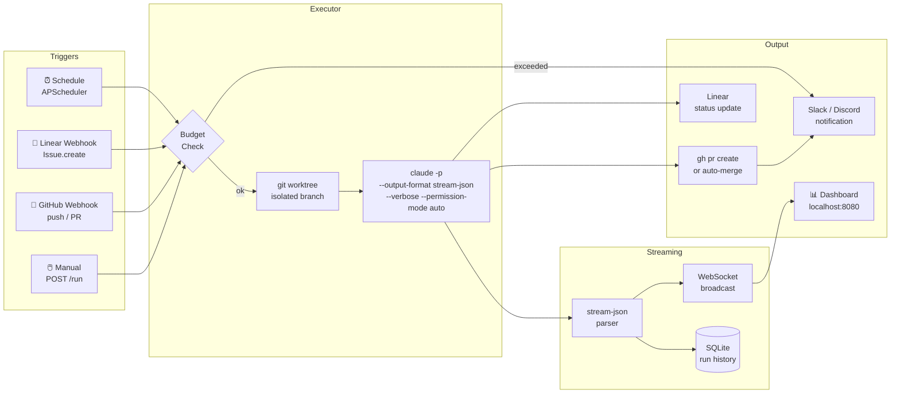

<div align="center">

# 📎 paperweight

**Your codebase works while you sleep.**

*A lean background agent runner for Claude Code — like [Paperclip](https://github.com/paperclipai/paperclip), but without the org charts.*

[](https://python.org)
[](LICENSE)
[](https://claude.ai/code)

</div>

---

## The problem nobody talks about

You've seen it. You open Claude Code, give it a task, and it's *brilliant*. It reads files, writes tests, opens PRs. You feel like you hired a senior engineer.

Then you close the laptop.

And nothing happens. Because Claude Code needs someone at the keyboard.

**Your backlog doesn't care that it's 2am. Your Linear board isn't going to resolve itself. And the scheduled maintenance that "someone should automate" has been on the roadmap for six months.**

Claude Code is powerful. But it's a tool, not a worker. You're still the one triggering it.

---

## What if it just ran?

paperweight runs Claude Code in the background, headless, on schedules and event triggers — without you.

It wakes up when a Linear issue is labeled `agent`. It runs the daily dependency audit at 6am. It resolves the GitHub issue that came in at midnight. It creates the PR, updates the ticket, sends you a Slack message, and goes back to sleep.

You show up in the morning to a list of PRs waiting for your review.

```
[09:00] myapp/issue-resolver triggered by linear:Issue.create (ENG-142)
[09:00] ↳ worktree /tmp/agents/myapp-issue-resolver-20260316-090012-a3f1b2
[09:00] ↳ claude -p "Implement ENG-142 — Add pagination to /api/users" --model claude-sonnet-4-6
[09:01] ↳ tool: Read(src/api/users.py)
[09:01] ↳ tool: Read(tests/test_users.py)
[09:02] ↳ tool: Edit(src/api/users.py) — added cursor-based pagination
[09:03] ↳ tool: Bash(pytest tests/test_users.py -v) — 12 passed
[09:04] ↳ tool: Bash(gh pr create ...) — https://github.com/org/myapp/pull/88
[09:04] ↳ PR created: $0.84 — 23 turns — 4m 12s
[09:04] ↳ Linear: ENG-142 → In Review
```

---

## Why not just use Paperclip?

[Paperclip](https://github.com/paperclipai/paperclip) is impressive — 27k stars, org charts, multi-company support. It's building the Kubernetes of AI agents.

paperweight is what you need before you need Kubernetes.

| | paperweight | Paperclip |
|---|---|---|
| Setup | `uv run agents` | Node.js + PostgreSQL + pnpm |
| Config | One YAML file | Org charts + approval gates |
| Focus | Claude Code (native) | Multi-agent (OpenClaw, CC, Codex, Cursor) |
| Governance | Paired with [devflow](https://github.com/viniciuscffreitas/devflow) | Built-in hierarchy |
| Scale | Your repos | Enterprise multi-company |
| Streams | Real-time `stream-json` parsing | Dashboard |

We built paperweight without knowing Paperclip existed. Different angle, same problem. The name is intentional.

---

## How it works



### The stream-json loop

Every line Claude Code writes to stdout is a JSON event. paperweight parses them in real time:

```python
# tool call happening right now
{"type": "assistant", "message": {"content": [{"type": "tool_use", "name": "Edit", "input": {"file_path": "..."}}]}}

# result with actual cost from the CLI itself
{"type": "result", "total_cost_usd": 0.84, "num_turns": 23, "is_error": false}
```

No polling. No waiting. You see every tool call as it happens, in the dashboard and over WebSocket.

### Git worktrees for true isolation

Every run gets its own worktree — a separate working directory pointing to a new branch, sharing the same `.git` history:

```
/tmp/agents/
  myapp-issue-resolver-20260316-090012-a3f1b2/  ← run A (branch: agents/issue-resolver-20260316-090012)
  myapp-daily-audit-20260316-060000-ff9c4d/      ← run B (branch: agents/daily-audit-20260316-060000)
```

Two agents working on the same repo simultaneously. No conflicts. Worktrees are removed after the run.

---

## Requirements

| Dependency | Why | Required? |
|---|---|---|
| [Python 3.13+](https://python.org) | Runtime | Yes |
| [uv](https://github.com/astral-sh/uv) | Package manager | Yes |
| [Claude Code](https://docs.anthropic.com/en/docs/claude-code) | The `claude` CLI must be installed and authenticated (`claude /login`) | Yes |
| [GitHub CLI](https://cli.github.com/) (`gh`) | Used to create PRs after each run | Yes, for `pr-only` / `auto-merge` |
| [git](https://git-scm.com/) 2.5+ | Worktree support for run isolation | Yes |
| Public URL or [ngrok](https://ngrok.com/) | Webhooks need to reach your server | Only for Linear/GitHub triggers |

> **Note:** `claude` and `gh` must be in your `$PATH` and authenticated before starting paperweight. The executor calls them directly as subprocesses.

## Quickstart

```bash
git clone https://github.com/viniciuscffreitas/paperweight
cd paperweight
cp .env.example .env         # add your keys (see comments inside)
uv run agents
```

Dashboard at **`http://localhost:8080/dashboard`**.

That's it.

---

## Configure a project

Drop a YAML file in `projects/`:

```yaml
# projects/myapp.yaml
name: myapp
repo: /path/to/your/repo
base_branch: main
branch_prefix: agents/
notify: slack

tasks:
  # Resolves Linear issues automatically when labeled "agent"
  issue-resolver:
    description: "Resolve a Linear issue end-to-end"
    intent: "Implement the given Linear issue following CLAUDE.md: TDD, lint, tests, PR"
    trigger:
      type: linear
      events: [Issue.create, Issue.update]
      filter:
        label: agent
    model: claude-sonnet-4-6
    max_cost_usd: 2.00
    autonomy: pr-only

  # Runs every morning at 6am
  daily-audit:
    description: "Audit dependencies and open issues for known CVEs"
    intent: "Check for outdated packages and security advisories. Create a PR with fixes."
    schedule: "0 6 * * *"
    model: claude-haiku-4-5-20251001
    max_cost_usd: 0.50
    autonomy: pr-only

  # Runs every Sunday at 2am
  weekly-cleanup:
    description: "Clean up dead code, unused imports, and TODO comments with issues"
    intent: "Identify and remove dead code. File issues for TODOs without tickets."
    schedule: "0 2 * * 0"
    model: claude-sonnet-4-6
    max_cost_usd: 1.00
    autonomy: auto-merge
```

---

## Global config

```yaml
# config.yaml
budget:
  daily_limit_usd: 10.00        # hard stop across all projects
  warning_threshold_usd: 7.00   # Slack alert before hitting the limit
  pause_on_limit: true

execution:
  default_model: sonnet
  default_autonomy: pr-only     # never merges without your review
  max_concurrent: 3             # runs in parallel
  timeout_minutes: 15
  dry_run: false                # set true to preview without executing

notifications:
  slack_webhook_url: ${SLACK_WEBHOOK_URL}

integrations:
  linear_api_key: ${LINEAR_API_KEY}
  discord_bot_token: ${DISCORD_BOT_TOKEN}
  github_token: ${GITHUB_TOKEN}           # for Project Hub source polling
  slack_bot_token: ${SLACK_BOT_TOKEN}     # for Project Hub source polling
```

All secrets from environment variables. Nothing hardcoded.

---

## Autonomy modes

paperweight never does more than you told it to.

| Mode | What happens |
|---|---|
| `pr-only` | Agent creates branch + PR. You review and merge. |
| `auto-merge` | Agent merges after PR passes CI. |
| `notify` | Dry run — reports what it *would* do. Nothing touched. |

Default is `pr-only`. You're always in control of what lands on `main`.

---

## The dashboard


*Live stream of every tool call, run history, budget gauge. Powered by [NiceGUI](https://nicegui.io).*

### Project Hub

The dashboard includes a **Project Hub** — a command center where you can manage projects, create tasks, and launch runs without editing YAML files.

#### Creating a project

Click **+ New Project** in the dashboard sidebar. The setup wizard walks you through:

1. **Basics** — project name, repo path, default branch
2. **Discover Sources** — auto-discovers linked Linear teams, GitHub repos, and Slack channels
3. **Notifications** — choose where to receive daily digests and urgent alerts

Existing YAML projects are auto-imported on first dashboard load.

#### Creating a task

Inside a project page, click **+ Task**. Each task has:

| Field | What it does |
|---|---|
| **Name** | Identifier for the task (e.g., `fix-bugs`, `daily-review`) |
| **Intent** | The prompt — natural language instructions for Claude. This is what the agent actually reads and executes. |
| **Trigger** | *When* the task runs: `manual` (on-demand), `schedule` (cron), or `webhook` (Linear/GitHub events) |
| **Model** | Which Claude model: `sonnet` (balanced), `opus` (most capable), `haiku` (fastest/cheapest) |
| **Max budget** | Cost ceiling per run in USD. The agent stops if it exceeds this. |
| **Autonomy** | *What happens with the result* — see [Autonomy modes](#autonomy-modes) above |

**Example task — daily code review:**
- **Name**: `daily-review`
- **Intent**: "Review all open PRs. Check test coverage, code quality, and CLAUDE.md compliance. Comment suggestions directly on the PR."
- **Trigger**: `schedule` (every day at 9am)
- **Model**: `sonnet`
- **Budget**: $3.00
- **Autonomy**: `notify` (analyze only, don't change code)

#### Running a task

From the project page, click **Run** to:
- **Run an existing task** — pick from the dropdown
- **Ad-hoc run** — type a one-off intent without saving it as a task

The live stream shows every tool call as it happens.

---

## Pairing with devflow

paperweight handles the background. [devflow](https://github.com/viniciuscffreitas/devflow) handles the foreground.

```
Interactive session (you + Claude Code)
  └── devflow: TDD enforcement, spec-driven dev, parallel agents, context window monitor

Background session (no one watching)
  └── paperweight: scheduled runs, webhook triggers, budget control, real-time streaming
```

devflow is the guardrails. paperweight is the engine. Together they form a complete autonomous coding stack.

Install devflow:

```bash
git clone https://github.com/viniciuscffreitas/devflow ~/.claude/devflow
bash ~/.claude/devflow/install.sh
```

---

## API

paperweight exposes a REST API for manual triggering and monitoring:

```bash
# Trigger a task manually
POST /tasks/{project_name}/{task_name}/run

# Cancel a running task
POST /runs/{run_id}/cancel

# Full status (budget + today's runs + projects)
GET /status

# Budget status
GET /status/budget

# Health check
GET /health

# WebSocket — stream events for a specific run
WS /ws/runs/{run_id}

# WebSocket — stream all events (global feed)
WS /ws/runs
```

---

## Webhooks

Webhooks require your server to be reachable from the internet. For local development, use a tunnel:

```bash
# ngrok (free tier works)
ngrok http 8080
# → https://abc123.ngrok.io  ← use this as your webhook URL
```

### Linear

1. In Linear Settings → API → Webhooks → create webhook pointing to `https://your-host/webhooks/linear`
2. Select events: `Issue` (create, update)
3. Label issues with `agent` to trigger runs
4. paperweight auto-deduplicates: same issue won't trigger twice within 120s

### GitHub

1. In repo Settings → Webhooks → add `https://your-host/webhooks/github`
2. Select: `push`, `pull_request`
3. Set secret in `.env` as `GITHUB_WEBHOOK_SECRET`

### No webhooks? No problem

Scheduled tasks (`schedule: "0 6 * * *"`) and manual triggers (`POST /tasks/{project}/{task}/run`) work without any external connectivity. Webhooks are optional.

---

## Running tests

```bash
uv run python -m pytest tests/ -v
# 299 tests across executor, streaming, budget, webhooks, scheduler, project hub
```

---

## Stack

- **[FastAPI](https://fastapi.tiangolo.com/)** — HTTP server + webhook handlers
- **[APScheduler](https://apscheduler.readthedocs.io/)** — cron scheduling
- **[SQLAlchemy](https://www.sqlalchemy.org/) + SQLite** — run history (zero ops)
- **[NiceGUI](https://nicegui.io/)** — dashboard
- **[Claude Code CLI](https://claude.ai/code)** — `claude -p --output-format stream-json --verbose`

---

## Roadmap

- [ ] Multi-model support (Gemini, GPT-4o) via provider config
- [ ] Retry logic with exponential backoff
- [ ] Run diffing — show what changed across attempts
- [ ] Email + PagerDuty notifications
- [ ] Docker image + Hetzner one-click deploy
- [x] Web UI for project + task management (without editing YAML)

---

## Contributing

paperweight is early. Issues, PRs, and ideas welcome.

If you're building something in the same space — background agents, Claude Code orchestration, autonomous coding pipelines — [open a discussion](https://github.com/viniciuscffreitas/paperweight/discussions). We're figuring this out together.

---

## License

MIT — use it, fork it, build on it.

---

<div align="center">

*Built without knowing [Paperclip](https://github.com/paperclipai/paperclip) existed.*
*Turns out we were solving the same problem from a different angle.*

**[⭐ Star if you're building with autonomous agents](https://github.com/viniciuscffreitas/paperweight)**

</div>
